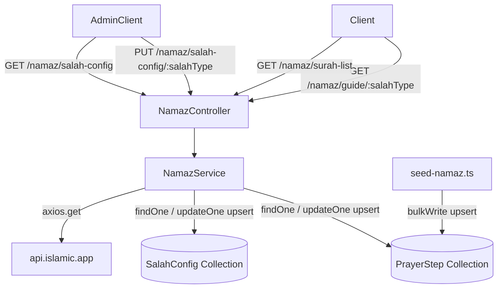

# Design Document — namaz-duwa

## Overview

The `namaz-duwa` feature adds a Namaz (prayer) guide module to the application alongside preserving the existing Duwa module. The core design splits into two independent sub-modules:

- **Namaz Module** (`src/app/modules/namaz/`) — seeds fixed prayer steps, manages Admin-configurable Additional Surah per Salah type by proxying data from the `islamic.app` external API, and exposes a public prayer guide endpoint.
- **Duwa Module** (`src/app/modules/dua/`) — unchanged; all existing endpoints and behavior are preserved as-is.

The Namaz module is added as a new Express router mounted at `/namaz` in `src/routes/index.ts`, following the same pattern used by every other module in the project.

---

## Architecture



**Key design decisions:**

1. **Two collections, not one.** `PrayerStep` stores the fixed 14-step sequence. `SalahConfig` stores the per-Salah-type Additional Surah fetched from the external API. Keeping them separate means the seed is truly static and Admin config changes never corrupt prayer step data.

2. **No caching layer for the external API proxy.** The `GET /namaz/surah-list` endpoint proxies islamic.app directly. The surah list changes at most once per Quran revision (effectively never). A production optimization can add Redis TTL caching later; the interface stays the same.

3. **502 without side effects.** If the external API call fails during `PUT /namaz/salah-config/:salahType`, the service throws before touching the database, so the existing config document is never partially overwritten.

4. **Admin role definition.** The requirements specify `ADMIN` and `SUPER_ADMIN` roles for admin endpoints. The existing `USER_ROLES` enum has only `SUPER_ADMIN` (no separate `ADMIN`). The auth middleware accepts `auth(USER_ROLES.SUPER_ADMIN)` matching the existing `dua.route.ts` pattern. If a distinct `ADMIN` role is added to the enum in future, the route guards are the only files that need updating.

---

## Components and Interfaces

### Module file layout

```
src/app/modules/namaz/
├── namaz.interface.ts       # TypeScript interfaces
├── namaz.model.ts           # Mongoose schemas (PrayerStep + SalahConfig)
├── namaz.validation.ts      # Zod request schemas
├── namaz.service.ts         # Business logic + external API calls
├── namaz.controller.ts      # Express route handlers
└── namaz.route.ts           # Router definition

src/scripts/
└── seed-namaz.ts            # One-time seed script for 14 prayer steps
```

### Route registration (`src/routes/index.ts`)

```typescript
import { NamazRoutes } from '../app/modules/namaz/namaz.route';
// ...
{ path: '/namaz', route: NamazRoutes }
```

### API surface

| Method | Path | Auth | Description |
|---|---|---|---|
| `GET` | `/namaz/surah-list` | Public | Proxy surah list from islamic.app |
| `PUT` | `/namaz/salah-config/:salahType` | SUPER_ADMIN | Fetch + upsert Additional Surah for a Salah type |
| `GET` | `/namaz/salah-config` | SUPER_ADMIN | Return all 5 Salah_Config documents |
| `GET` | `/namaz/guide/:salahType` | Public | Return full 14-step prayer guide |

---

## Data Models

### PrayerStep (`prayersteps`)

Stores the fixed 14-step Namaz sequence. Managed exclusively by the seed script.

```typescript
// namaz.interface.ts
export interface IPrayerStep extends Document {
  stepKey: string;          // slug identifier, e.g. 'niyyah', 'additional-surah'
  order: number;            // 1–14, used for deterministic sort
  stepName: string;
  arabicText: string;
  transliteration: string;
  translation: string;
  isPlaceholder: boolean;   // true only for 'additional-surah' step
  createdAt: Date;
  updatedAt: Date;
}
```

**Mongoose schema:**

```typescript
const PrayerStepSchema = new Schema<IPrayerStep>(
  {
    stepKey:        { type: String, required: true, unique: true },
    order:          { type: Number, required: true },
    stepName:       { type: String, required: true },
    arabicText:     { type: String, required: true },
    transliteration:{ type: String, required: true },
    translation:    { type: String, required: true },
    isPlaceholder:  { type: Boolean, default: false },
  },
  { timestamps: true },
);

PrayerStepSchema.index({ order: 1 });
```

### SalahConfig (`salahconfigs`)

One document per Salah type, upserted when Admin configures the Additional Surah.

```typescript
export type TSalahType = 'Fajr' | 'Dhuhr' | 'Asr' | 'Maghrib' | 'Isha';

export interface IWordByWord {
  arabic: string;
  transliteration: string;
  meaning: string;
}

export interface ISalahConfig extends Document {
  salahType: TSalahType;
  surahNumber: number;
  surahName: string;
  arabicText: string;
  transliteration: string;
  translation: string;
  wordByWord: IWordByWord[];
  audioUrl: string;
  createdAt: Date;
  updatedAt: Date;
}
```

**Mongoose schema:**

```typescript
const WordByWordSchema = new Schema<IWordByWord>(
  {
    arabic:         { type: String, required: true },
    transliteration:{ type: String, required: true },
    meaning:        { type: String, required: true },
  },
  { _id: false },
);

const SalahConfigSchema = new Schema<ISalahConfig>(
  {
    salahType:      {
      type: String,
      enum: ['Fajr', 'Dhuhr', 'Asr', 'Maghrib', 'Isha'],
      required: true,
      unique: true,
    },
    surahNumber:    { type: Number, required: true, min: 1, max: 114 },
    surahName:      { type: String, required: true },
    arabicText:     { type: String, required: true },
    transliteration:{ type: String, required: true },
    translation:    { type: String, required: true },
    wordByWord:     { type: [WordByWordSchema], default: [] },
    audioUrl:       { type: String, required: true },
  },
  { timestamps: true },
);

SalahConfigSchema.index({ salahType: 1 });
```

---

## External API Integration Design

**Base URL:** `https://api.islamic.app`  
**Client:** axios (existing dependency, no auth required)

### Endpoints used

| Purpose | HTTP call |
|---|---|
| Fetch a single Surah | `GET https://api.islamic.app/surah/{surahNumber}` |
| List all 114 Surahs | `GET https://api.islamic.app/surahs` |

> The exact paths must be verified against the live API during implementation. The service layer abstracts the URL behind a private helper `IslamicAppClient` so future path changes only touch one place.

### Response mapping

When `PUT /namaz/salah-config/:salahType` is called, the service:

1. Calls `GET https://api.islamic.app/surah/{surahNumber}` with a 10-second timeout.
2. Maps the response to `ISalahConfig` fields. Field mapping:

```typescript
// Internal helper — not exported
async function fetchSurahData(surahNumber: number): Promise<Omit<ISalahConfig, 'salahType' | 'surahNumber'>> {
  const response = await axios.get(
    `https://api.islamic.app/surah/${surahNumber}`,
    { timeout: 10_000 },
  );
  const d = response.data;
  return {
    surahName:      d.name,
    arabicText:     d.arabicText,
    transliteration:d.transliteration,
    translation:    d.translation,
    wordByWord:     (d.wordByWord ?? []).map((w: any) => ({
      arabic:         w.arabic,
      transliteration:w.transliteration,
      meaning:        w.meaning,
    })),
    audioUrl:       d.audioUrl,
  };
}
```

3. If the axios call throws (network error, timeout, non-2xx), throws `ApiError(502, 'Islamic App API is currently unavailable')` **before** any database write.
4. Performs a MongoDB upsert on `SalahConfig` with `{ salahType }` as the filter.

### 502 guard

```typescript
try {
  const surahData = await fetchSurahData(surahNumber);
  // database write only reaches here on success
} catch (err) {
  if (err instanceof ApiError) throw err;
  throw new ApiError(StatusCodes.BAD_GATEWAY, 'Islamic App API is currently unavailable');
}
```

---

## Seed Script Design

**Path:** `src/scripts/seed-namaz.ts`

The seed uses `bulkWrite` with `upsert: true`, matching on `stepKey`. This is safe to re-run at any time — on a fresh database it inserts 14 documents; on an existing database it updates them in place without creating duplicates.

```typescript
const PRAYER_STEPS = [
  { stepKey: 'niyyah',            order: 1,  stepName: 'Niyyah', ... },
  { stepKey: 'takbir',            order: 2,  stepName: 'Takbir (Takbiratul Ihram)', ... },
  { stepKey: 'sana',              order: 3,  stepName: 'Sana', ... },
  { stepKey: 'surah-al-fatihah',  order: 4,  stepName: 'Surah Al-Fatihah', ... },
  { stepKey: 'additional-surah',  order: 5,  stepName: 'Additional Surah',
    arabicText: '', transliteration: '', translation: '', isPlaceholder: true },
  { stepKey: 'ruku',              order: 6,  stepName: 'Ruku', ... },
  { stepKey: 'qaumah',            order: 7,  stepName: 'Qaumah', ... },
  { stepKey: 'first-sajdah',      order: 8,  stepName: 'First Sajdah', ... },
  { stepKey: 'jalsah',            order: 9,  stepName: 'Jalsah', ... },
  { stepKey: 'second-sajdah',     order: 10, stepName: 'Second Sajdah', ... },
  { stepKey: 'tashahhud',         order: 11, stepName: 'Tashahhud', ... },
  { stepKey: 'durood-ibrahim',    order: 12, stepName: 'Durood Ibrahim', ... },
  { stepKey: 'dua',               order: 13, stepName: 'Dua', ... },
  { stepKey: 'salam',             order: 14, stepName: 'Salam', ... },
];

// Per-step error isolation — a write error on one step does not abort the rest
const ops = PRAYER_STEPS.map(step => ({
  updateOne: {
    filter: { stepKey: step.stepKey },
    update: { $set: step },
    upsert: true,
  },
}));

for (const op of ops) {
  try {
    await PrayerStepModel.bulkWrite([op]);
  } catch (err) {
    console.error(`[seed-namaz] Failed to seed step: ${op.updateOne.filter.stepKey}`, err);
    // continue to next step
  }
}
```

> **Note:** Splitting into individual `bulkWrite([op])` calls rather than one `bulkWrite(ops)` call satisfies requirement 1.4 — a failure on one step is caught and logged, and the loop continues for the remaining steps.

---

## Service Layer Design

### `upsertSalahConfig(salahType, surahNumber)`

1. Validate `surahNumber` in [1, 114] and `salahType` in the enum (Zod handles this before the service is called).
2. Fetch surah data from islamic.app; throw 502 on failure.
3. `SalahConfigModel.findOneAndUpdate({ salahType }, { $set: { surahNumber, ...surahData } }, { upsert: true, new: true, runValidators: true })`.
4. Return the saved document.

### `getAllSalahConfigs()`

1. `SalahConfigModel.find({})`.
2. Return array (0–5 documents depending on what has been configured).

### `getPrayerGuide(salahType)`

1. `PrayerStepModel.find({}).sort({ order: 1 })` — always 14 documents in fixed order.
2. `SalahConfigModel.findOne({ salahType })` — may be null.
3. Map the steps array: for the step where `isPlaceholder === true` (stepKey `additional-surah`):
   - If config exists: replace `stepName`, `arabicText`, `transliteration`, `translation` with config values; append `wordByWord` and `audioUrl` from config.
   - If config is null: keep placeholder text, set `wordByWord: []`, `audioUrl: null`.
4. Return the 14-step array.

### `getSurahList()`

1. Proxies `GET https://api.islamic.app/surahs` with a 10-second timeout.
2. Returns the response data directly to the controller.
3. Throws 502 on failure.

---

## Correctness Properties

*A property is a characteristic or behavior that should hold true across all valid executions of a system — essentially, a formal statement about what the system should do. Properties serve as the bridge between human-readable specifications and machine-verifiable correctness guarantees.*

### Property 1: Seed idempotency

*For any* number of times the seed script is re-run against a populated database, the total count of PrayerStep documents SHALL remain exactly 14 with no duplicates.

**Validates: Requirements 1.2**

---

### Property 2: Seed field completeness

*For any* PrayerStep document where `isPlaceholder` is `false`, the fields `arabicText`, `transliteration`, and `translation` SHALL be non-empty strings after the seed script completes.

**Validates: Requirements 1.3**

---

### Property 3: Seed error resilience

*For any* subset of steps that fail to write due to a simulated DB error, the remaining steps SHALL be present in the database after the seed script finishes.

**Validates: Requirements 1.4**

---

### Property 4: surahNumber input validation

*For any* integer outside the range [1, 114], or any non-integer value, or an absent `surahNumber` field in the request body, the `PUT /namaz/salah-config/:salahType` endpoint SHALL return `400 Bad Request` without reaching the external API or the database.

**Validates: Requirements 2.1, 2.8**

---

### Property 5: SalahConfig upsert produces exactly one document per Salah type

*For any* valid Salah type and any number of `PUT /namaz/salah-config/:salahType` calls (with the same or different `surahNumber` values), the `SalahConfig` collection SHALL contain exactly one document for that Salah type after each call completes successfully.

**Validates: Requirements 2.3, 2.4, 2.5**

---

### Property 6: External API failure leaves SalahConfig unchanged

*For any* existing `SalahConfig` document, when the Islamic App API returns a non-2xx response or is unreachable, the `PUT /namaz/salah-config/:salahType` endpoint SHALL return `502 Bad Gateway` and the existing `SalahConfig` document SHALL remain unmodified.

**Validates: Requirements 2.6**

---

### Property 7: Invalid salahType path parameter returns 400 on all routes

*For any* string value that is not one of `['Fajr', 'Dhuhr', 'Asr', 'Maghrib', 'Isha']` supplied as `:salahType`, both `PUT /namaz/salah-config/:salahType` and `GET /namaz/guide/:salahType` SHALL return `400 Bad Request` with a message listing the valid values.

**Validates: Requirements 2.7, 3.6**

---

### Property 8: Prayer guide returns 14 ordered steps with all required fields

*For any* valid Salah type, `GET /namaz/guide/:salahType` SHALL return an array of exactly 14 objects, ordered by `order` ascending (1 to 14), where every object contains the fields `stepKey`, `stepName`, `arabicText`, `transliteration`, and `translation`, regardless of the database insertion order of the underlying `PrayerStep` documents.

**Validates: Requirements 3.2, 3.7**

---

### Property 9: Additional Surah step is correctly merged from SalahConfig

*For any* Salah type that has a configured `SalahConfig`, the step at position 5 (index 4) of the guide response SHALL have `stepKey === 'additional-surah'`, `stepName`, `arabicText`, `transliteration`, and `translation` matching the stored `SalahConfig` fields, a non-empty `wordByWord` array, and a non-null `audioUrl`.

**Validates: Requirements 3.3, 3.4**

---

### Property 10: Missing SalahConfig falls back gracefully

*For any* Salah type with no configured `SalahConfig`, `GET /namaz/guide/:salahType` SHALL return HTTP 200 with the `additional-surah` step present, `wordByWord` as an empty array `[]`, and `audioUrl` as `null`, without returning an error.

**Validates: Requirements 3.5**

---

## Error Handling

All error handling follows the existing `ApiError` + `catchAsync` pattern.

| Scenario | HTTP status | Behaviour |
|---|---|---|
| Missing / malformed Bearer token | 401 | `auth()` middleware throws before controller runs |
| Valid token, insufficient role | 403 | `auth()` middleware throws before controller runs |
| Invalid `:salahType` param | 400 | Zod param validation at route layer |
| `surahNumber` out of range / wrong type | 400 | Zod body validation at route layer |
| Islamic App API unreachable / non-2xx on PUT | 502 | `ApiError(BAD_GATEWAY)` thrown in service before DB write |
| Islamic App API unreachable / non-2xx on GET /surah-list | 502 | `ApiError(BAD_GATEWAY)` thrown in service |
| Axios timeout (10 s) | 502 | Caught by the same 502 guard as above |
| MongoDB write error on upsert | 500 | Unhandled — propagates to global error handler |

**Global error handler** (already in place at `src/app.ts`) catches all unhandled `ApiError` instances and formats them using the project's standard envelope.

---

## Testing Strategy

### Unit tests (example-based)

Target: service layer functions with mocked Mongoose models and mocked axios.

- `upsertSalahConfig` — happy path stores correct fields; 502 guard fires on axios error; existing doc is not modified when API fails.
- `getPrayerGuide` — config present: step 5 merged correctly; config absent: step 5 uses placeholder.
- `getSurahList` — proxies API response; 502 on failure.
- Auth middleware integration — 401 without token, 403 with wrong role (these use the existing middleware so a single integration test per role scenario is sufficient).

### Property-based tests

Use **fast-check** (standard for TypeScript projects).  
Each property test runs a minimum of **100 iterations**.  
Tag format: `// Feature: namaz-duwa, Property N: <property_text>`

| Property | fast-check arbitraries |
|---|---|
| P1 — Seed idempotency | `fc.integer({ min: 2, max: 20 })` for re-run count |
| P2 — Seed field completeness | `fc.constantFrom(...PRAYER_STEPS.filter(s => !s.isPlaceholder))` |
| P3 — Seed error resilience | `fc.subarray(STEP_KEYS)` for failing steps |
| P4 — surahNumber validation | `fc.integer().filter(n => n < 1 || n > 114)`, `fc.string()`, `fc.float()` |
| P5 — SalahConfig upsert once | `fc.constantFrom('Fajr','Dhuhr','Asr','Maghrib','Isha')`, `fc.integer({min:1,max:114})` |
| P6 — API failure preserves config | `fc.record(...)` generating a SalahConfig, then mock axios to throw |
| P7 — Invalid salahType → 400 | `fc.string().filter(s => !VALID_SALAH_TYPES.includes(s as any))` |
| P8 — 14 ordered steps | `fc.constantFrom('Fajr','Dhuhr','Asr','Maghrib','Isha')` |
| P9 — Config merged correctly | `fc.record(...)` generating a SalahConfig with wordByWord entries |
| P10 — Fallback graceful | `fc.constantFrom('Fajr','Dhuhr','Asr','Maghrib','Isha')` with no config seeded |

### Integration / regression

- All existing Dua module endpoints (`POST /duas`, `GET /duas`, `GET /duas/:duaId`, `PATCH /duas/:duaId`, `DELETE /duas/:duaId`) must pass their existing test suite unchanged — no new tests required for Requirement 4.
- Seed script: run against a test MongoDB instance, assert count == 14 and `order` sequence is 1–14.
